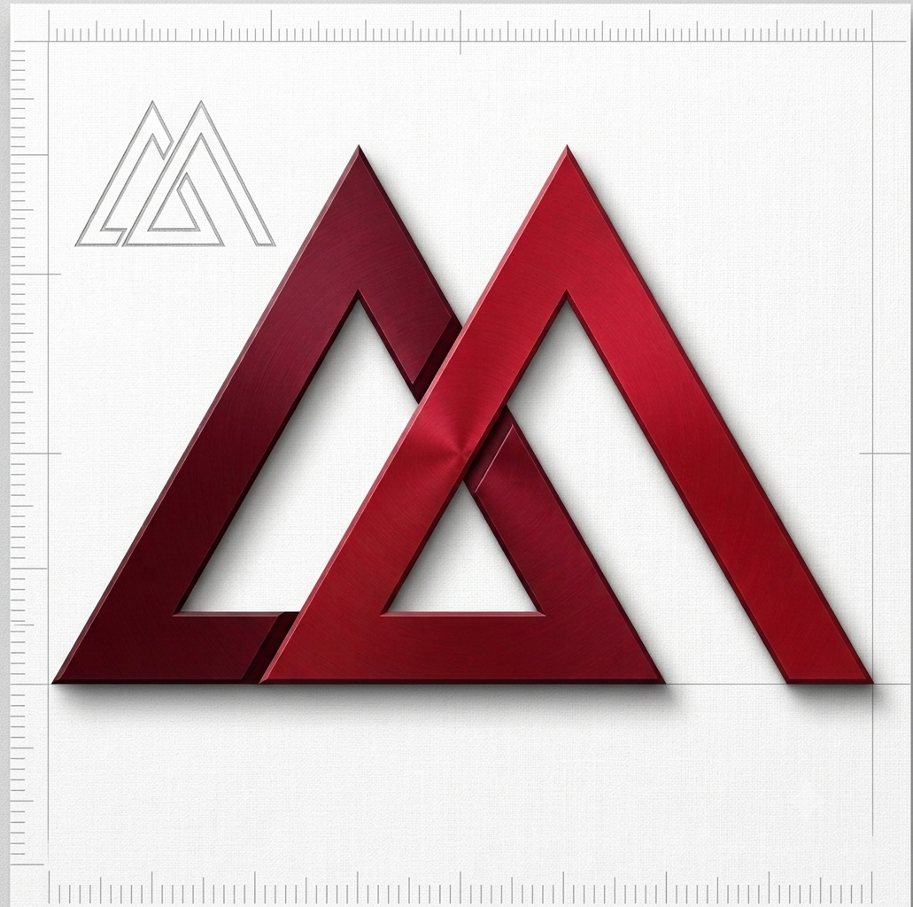

<picture>
  <source media="(prefers-color-scheme: dark)" srcset="./src/assets/logo.png">
  
</picture>

# MG & Associés — Audit & Advisory Website

> Prototype v0.1 — a brand portal for MG & Associés (formerly Cabinet Mourad Guellaty), an audit and advisory firm based in Gabès and Tunis, Tunisia.

---

## Overview

A purpose-built React + TypeScript landing page that communicates the firm's heritage (est. 1983), service offering, methodology, and values. Designed with a blueprint-inspired aesthetic — tick marks, crosshair corners, and a restrained industrial palette.

## Features

- **Blueprint visual language** — fixed tick marks, corner crosshairs, mono/serif typography pairing
- **8 content sections** — Hero, Overview, Services, Why Choose Us, Values, Approach, Client Sectors, Contact
- **Dark mode** — auto-detects system preference with manual toggle (persisted in localStorage)
- **Responsive** — mobile hamburger nav, stacked grids on smaller viewports
- **Accessible** — `prefers-reduced-motion` support, focus-visible outlines
- **Typed data layer** — services, stats, values, client sectors driven by typed arrays for easy editing
- **CSS Modules** + **CSS custom properties** — consistent theming via `tokens.css`

## Tech Stack

| Layer | Choice |
|---|---|
| Framework | React 19 + TypeScript |
| Build | Vite 8 |
| Styling | CSS Modules + custom properties |
| Linting | Oxlint |
| Fonts | Fraunces (serif), IBM Plex Sans (sans), IBM Plex Mono (mono) |

## Getting Started

```bash
git clone https://github.com/eyadhrif/cmg-blueprint.git
cd cmg-blueprint/cmg-website
npm install
npm run dev
```

Open [http://localhost:5173](http://localhost:5173) in your browser.

### Scripts

| Command | Description |
|---|---|
| `npm run dev` | Start dev server (Vite) |
| `npm run build` | Type-check + production build |
| `npm run preview` | Preview production build |
| `npm run lint` | Run Oxlint |

## Project Structure

```
cmg-website/
├── public/               # Static assets (favicon)
├── src/
│   ├── assets/           # Logo image
│   ├── components/       # 9 components + BlueprintFrame
│   │   ├── Approach/
│   │   ├── BlueprintFrame/  # TickMarks, Crosshair, Frame wrapper
│   │   ├── ClientSectors/
│   │   ├── Contact/
│   │   ├── Footer/
│   │   ├── Hero/
│   │   ├── Nav/
│   │   ├── Overview/
│   │   ├── Services/
│   │   ├── Values/
│   │   └── WhyChooseUs/
│   ├── data/             # Typed content arrays (services, stats, etc.)
│   ├── styles/
│   │   ├── tokens.css    # CSS custom properties (light + dark)
│   │   └── global.css    # Base reset, utilities, shared patterns
│   ├── App.tsx
│   └── main.tsx
├── index.html
└── package.json
```

## Customising Content

Edit the files under `src/data/` to update any text:

| File | Content |
|---|---|
| `overview.ts` | Firm stats (years, team composition, sectors) |
| `services.ts` | Service offerings with detail items |
| `whyChooseUs.ts` | Differentiators (5 reasons) |
| `values.ts` | Firm values |
| `clients.ts` | Client names by sector |

## Dark Mode

The site respects your system's `prefers-color-scheme` automatically. Use the **Dark** / **Light** toggle in the navigation bar to override. Your choice is saved in `localStorage`.

## Status

**Prototype** — content reviewed but not finalised. Contact form is UI-only (not wired to a backend). Client names included pending final confirmation.

---

<p align="center">
  <sub>Built with React + TypeScript + Vite</sub>
  <br>
  <sub>MG & Associés · Audit & Advisory · Est. 1983</sub>
</p>
